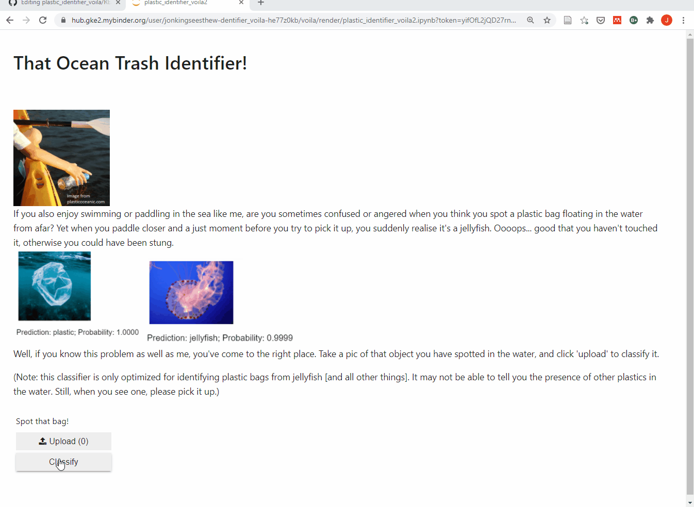

# That Ocean Trash Identifier!

(A simple object classification project using FastAI)

If you also enjoy swimming or paddling in the sea like me, are you sometimes confused or angered when you think you spot a plastic bag floating in the water from afar? Yet when you paddle closer and a just moment before you try to pick it up, you suddenly realise it's a jellyfish. Oooops... good that you haven't touched it, otherwise you could have been stung.

Well, if you know this problem as well as me, you've come to the right place. Take a pic of that object you have spotted in the water, and click 'upload' to classify it.

[Click here to try the app](https://mybinder.org/v2/gh/jonkingseestheworld/plastic_identifier_voila/master?urlpath=voila%2Frender%2Fplastic_identifier_voila2.ipynb
)! The app runs on Binder, which is a free service that provides the hardware and software to run your codes 'online'. **For the first time you visit the page, Binder can take a bit of time to run.**

